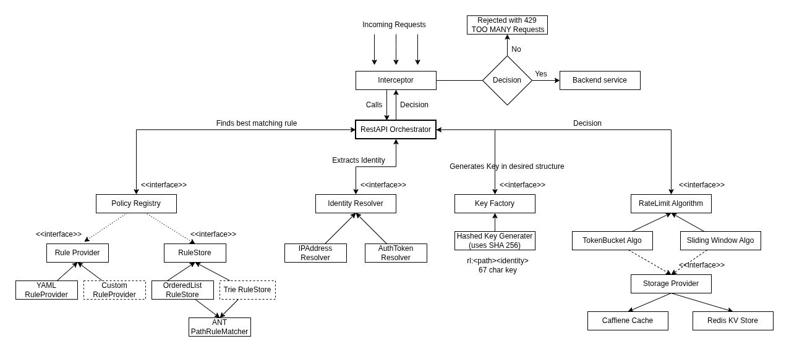

# RateLimiter As a Service

A production-grade, thread safe rate limiter built for high concurrency

[](https://opensource.org/licenses/MIT)
[](https://adoptium.net/)
[](https://spring.io/projects/spring-boot)

---
## Features
1. Pluggable Strategy Engine: Supports multiple rate-limiting algorithms, including Token Bucket and Probabilistic Sliding Window, adhering to the Strategy Pattern for seamless addition of new logic without modifying core code.
2. High-Performance Hybrid Storage: Leverages a dual-layer approach with Caffeine (L1) for local in-memory speed and Redis (L2) for distributed consistency.
3. Guaranteed Thread Safety: Ensures strict atomicity through Lua scripting for Redis operations and Caffeine’s atomic compute functions, preventing race conditions during high-concurrency 10k user load tests.
4. Storage-Optimized Key Management: Implements a unique Mashed Key Generator that produces fixed 64/67-character hashes, ensuring predictable storage overhead in Redis regardless of the URI path or identifier length.
5. Extensible Policy Management: Features a decoupled Rule Provider interface, allowing the system to ingest rate-limit policies from YAML, Databases, or any custom external data source.
5. Granular Rule Resolution: Offers the flexibility to assign specific algorithms and limits on a per-rule basis, resolved dynamically via IP Address or Auth Token.
6. In case of Infrastructure exceptions, rate limiter can be configured to react with by pass settings as set by the admin.

---
## Architecture


---

## Component Overview
**Interceptor** - Intercepts every API requests and calls the Orchestrator to make a decision.
**RestAPI Orchestrator** — Delegates to three subsystems in sequence: policy lookup, identity extraction, and key generation. The resolved key and policy are then passed to the algorithm to make an allow/deny decision.

**Policy Registry** — finds the best matching rule for an incoming request path. Backed by a `RuleStore` (interface), with two implementations provided:
- `OrderedList RuleStore` — linear scan, suitable for small rule sets
- `Trie RuleStore` prefix-based lookup, suitable for large rule sets

Rules are loaded via a `RuleProvider` (interface). Two implementations are included:
- `YAML RuleProvider` — loads rules from `application.yml`
- `Custom RuleProvider` — implement your own rule source

Path matching is handled by `ANT PathRuleMatcher`, supporting wildcard patterns (`/api/**`, `/api/users/*`).

**Identity Resolver** — extracts the subject identity from the request to scope the rate limit. Two built-in implementations:
- `IPAddress Resolver` — limits by client IP address
- `AuthToken Resolver` — limits by authenticated user token

**Key Factory** — generates the storage key in a consistent structure. The `Hashed Key Generator` (SHA-256) produces a deterministic 67-character key in the format `rl:<path><identity>`. This ensures keys are fixed-length regardless of path or identity length, and avoids collisions across endpoints.

**Rate Limit Algorithm** — makes the allow/deny decision. Two implementations provided:
- `TokenBucket Algo` — allows controlled bursting; tokens refill at a fixed rate
- `Sliding Window Algo` — enforces a strict request count over a rolling time window

Both algorithms delegate to the **Storage Provider** (interface), which abstracts the counter backend:
- `Caffeine Cache` — in-process cache for single-instance deployments
- `Redis KV Store` — distributed counter store for multi-instance deployments

---


## Extending the Project

Every subsystem is interface-backed. Plug in your own implementation by declaring a Spring bean.

**Custom rule source:**
```java
@Component
public class DatabaseRuleProvider implements RuleProvider {
    @Override
    public List<RateLimitRule> loadRules() {
        return ruleRepository.findAll(); // load from DB, config service, etc.
    }
}
```

**Custom identity resolver:**
```java
@Component
public class ApiKeyResolver implements IdentityResolver {
    @Override
    public String resolve(HttpServletRequest request) {
        return request.getHeader("X-API-Key");
    }
}
```

**Custom rule store:**
```java
@Component
public class MyRuleStore implements RuleStore {
    @Override
    public Optional<RateLimitRule> findBest(String path) {
        // your matching logic
    }
}
```

---

## Key Design Notes

**SHA-256 key hashing** — the Key Factory hashes `<path><identity>` to a fixed 67-character key. This keeps Redis keys uniform in size, prevents hot-key patterns based on path length, and avoids collisions between endpoints with similar prefixes.

**ANT path matching** — rules support `?` (single character), `*` (path segment), and `**` (any path depth). More specific rules take priority over broader ones. The `Trie RuleStore` is recommended when rule count is large.

**Lua Script and Atomic compute** — To ensure fast , consistent state operations,Lua script is used for redis and atomic compute is used for Caffeine cache

---

## Tech Stack

- Java 17 or 21 (LTS)
- Spring Boot 3.x 
- Caffeine — in-process rate limit counters
- Redis (Lettuce) — distributed rate limit counters
- SHA-256 (JDK) — key generation

---

## License

MIT — see [LICENSE](LICENSE) for details.