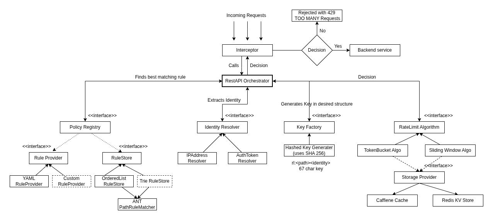

# RateLimiter As a Service

A production-grade, thread-safe rate limiter built for high concurrency.
Pluggable algorithms, dual storage backends, and atomic consistency
guarantees — designed so every component is replaceable without
touching core logic.

[](https://opensource.org/licenses/MIT)
[](https://adoptium.net/)
[](https://spring.io/projects/spring-boot)

---
## The Problem this project solves

A rate limiter sits in the hot path of every request.
The core challenge is not the counting — it is guaranteeing
that concurrent requests against the same key never produce
an inconsistent counter state.

This is how the problem is solved :

- **Caffeine (single instance):** atomic read-compute-write via
  `ConcurrentHashMap.compute()` — bin-level CAS lock ensures
  only one thread executes the BiFunction per key at a time.

- **Redis (distributed):** Lua scripts execute as a single atomic
  command — eliminating the race window between GET and SET
  that exists when commands are issued separately.

In both cases: no two threads or clients can compute a new
counter value against the same stale state simultaneously.
## Features

1. **Pluggable Algorithm Engine**  
   Token Bucket, Fixed Window, Sliding Window Log, and
   Sliding Window Counter — each configurable at the rule level,
   not globally. Add a new algorithm by implementing one interface
   and declaring a Spring bean. No core code changes.

2. **Dual Storage Backend**  
   Caffeine for single-instance, in-process speed. Redis for
   distributed, multi-instance consistency. Storage is abstracted
   behind an interface — the algorithm has zero knowledge of
   what sits beneath it.

3. **Atomic Consistency Guarantees**  
   Caffeine uses bin-level locking via CAS. Redis uses Lua script
   execution — treated as one atomic command by the Redis engine.
   Both guarantee the read-compute-write cycle is indivisible.

4. **Storage-Optimised Key Management**  
   SHA-256 hashing produces a deterministic fixed-length 67-character
   key regardless of path or identity length. Prevents hot-key
   patterns, avoids prefix collisions, and keeps Redis memory
   overhead predictable at scale.

5. **Flexible Rule Resolution**  
   ANT path pattern matching supports wildcard rules
   (`/api/**`, `/api/users/*`). Specific rules take priority
   over generic ones by default — configurable via explicit
   priority when needed.

6. **Pluggable Identity Strategy**  
   Scope rate limits by IP address, Auth Token, API Key,
   or any custom identity — resolved per rule, not globally.
   Add a resolver by implementing one interface.

7. **Pluggable Rule Source**  
   Load rules from YAML, a database, a config service, or
   any custom source. The Rule Provider interface decouples
   policy ingestion from policy enforcement entirely.

8. **Fault Tolerant by Design**  
   Infrastructure failures (Redis down, cache miss) are handled
   gracefully. The system can be configured to fail open
   (bypass) or fail closed (deny) — admin-configurable per deployment.

---
## Architecture


---
### Design Philosophy

Every component is interface-backed and agnostic of its neighbours.

- The algorithm does not know which storage provider sits beneath it.
- The orchestrator does not know which algorithm is executing.
- The rule engine does not know how rules were loaded.

This means any layer can be swapped, extended, or tested
in isolation without modifying any other layer.
---
## Component Breakdown

**Interceptor**  
Intercepts every incoming request and delegates to the Orchestrator.
Returns HTTP 429 Too Many Requests when the decision is deny.

**RestAPI Orchestrator**  
The central coordinator. Executes the decision pipeline in sequence:
rule resolution → identity extraction → key generation →
algorithm execution. Each step is delegated to an interface —
the orchestrator owns the flow, not the logic.

**Policy Registry**  
Finds the best matching rule for an incoming request path.

Rule storage is backed by `RuleStore` (interface):
- `OrderedListRuleStore` — linear scan ordered by priority.
  When priority is not configured, pattern length is used —
  ensuring specific rules win over generic ones by default.
- `TrieRuleStore` — TODO

Rules are loaded via `RuleProvider` (interface):
- `YAMLRuleProvider` — loads from `application.yml`
- `CustomRuleProvider` — implement your own source (DB, config service)

Path matching uses `ANT PathRuleMatcher` — supports `?`, `*`, `**` wildcards.

**Identity Resolver**  
Extracts the client identity from the request as defined by
the rule's identity strategy. Built-in implementations:
- `IPResolver` — reads `x-forwarded-for` header
- `AuthTokenResolver` — reads Authorization header

**Key Factory**  
Generates a deterministic storage key from path + identity.  
The `HashedKeyGenerator` applies SHA-256 to produce a
fixed 67-character key in the format `rl:<hash>`.

Why SHA-256:
- Fixed-length output regardless of path complexity
- Collision-resistant across endpoints with similar prefixes
- Uniform key size keeps memory overhead predictable

**Rate Limit Algorithm**  
Owns the mathematics of rate limiting. Exposes a single
`isAllowed` decision. Four implementations:

| Algorithm | Accuracy | Memory | Best For |
|---|---|---|---|
| Token Bucket | High | Low | APIs needing burst tolerance |
| Fixed Window | Medium | Very Low | Simple, low-stakes limits |
| Sliding Window Log | Exact | High | Strict edge accuracy required |
| Sliding Window Counter | Probabilistic | Low | High-throughput, efficiency-first |
All algorithms delegate to `StorageProvider` (interface):
- `CaffeineCache` — in-process, single-instance deployments
- `RedisKVStore` — distributed, multi-instance deployments

**Concurrency guarantee per provider:**

```
Caffeine:  bin-level lock (CAS) → BiFunction executes atomically per key
           different keys run in parallel (different bins)
           
Redis:     Lua script = one atomic command to Redis engine
           single-threaded command execution = no interleaving possible
```
---


## Extending the Project

Every subsystem is interface-backed. Add your own implementation
as a Spring bean — no existing code changes required.
**Custom rule source:**
```java
@Component
public class DatabaseRuleProvider implements RuleProvider {
    @Override
    public List<AbstractRule> loadRules() {
        //Fetch rules as per your provider API
        return rules; // load from DB, config service, etc.
    }
}
```

**Custom identity resolver:**
```java
@Component
public class ApiKeyResolver implements IdentityResolver {
    @Override
    public String resolve(HttpServletRequest request) {
        return request.getHeader("X-API-Key");
    }
}
```

**Custom rule store:**
This is an example of how you can plug your own rule store.
```java
@Component
public record TrieRuleStore(List<AbstractRule> rules) implements RuleStore {
    public TrieRuleStore(List<AbstractRule> rules){
        // construct a Trie Data Structure from the rules
        this.rules = trieDataStructureRules;
    }
    @Override
    public Optional<AbstractRule> findBestMatch(String requestPath) {
        
        //This function must implement logic to find a match in a Trie Data Structure
        return rules.find(requestPath);
    }
}
```

**Custom algorithm:**
```java
@Component
public class LeakyBucketAlgorithm implements RateLimitAlgorithm {
    @Override
    public RateLimitDecision isAllowed(String key, RateLimitRule rule) {
        // Send the rate limit context
        // your algorithm logic
    }
    @Override
    public RateLimitSpecs.Algorithm getAlgorithmType(){
        //return your algorithm type
    }
}
```

---

### Tech Stack


| Layer | Technology | Purpose |
|---|---|---|
| Runtime | Java 17 / 21 LTS | Core language |
| Framework | Spring Boot 3.x | DI, interceptors, autoconfiguration |
| In-process cache | Caffeine | Single-instance rate limit counters |
| Distributed store | Redis (Lettuce) | Multi-instance rate limit counters |
| Key generation | SHA-256 (JDK) | Fixed-length collision-resistant keys |
| Load testing | Gatling | Concurrency and accuracy verification |
| Path matching | Apache ANT | Wildcard rule resolution |
---
## Getting Started

Prerequisites: Java 17+, Maven, Redis (optional)

→ [Full setup and configuration guide](QUICKSTART.md)
---
## Testing

The system has been verified under sustained load and concurrent
access using Gatling. Each algorithm has a dedicated accuracy
test that validates correctness under concurrency — not just
in isolation.

---

## License

MIT — see [LICENSE](LICENSE) for details.